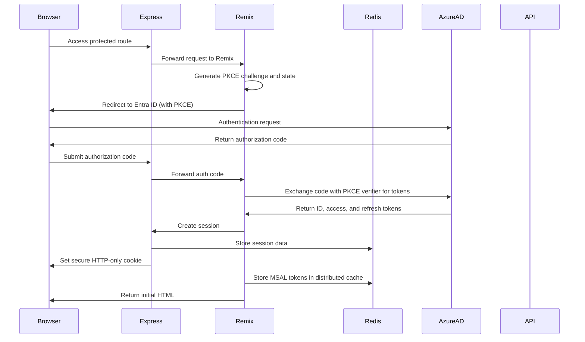
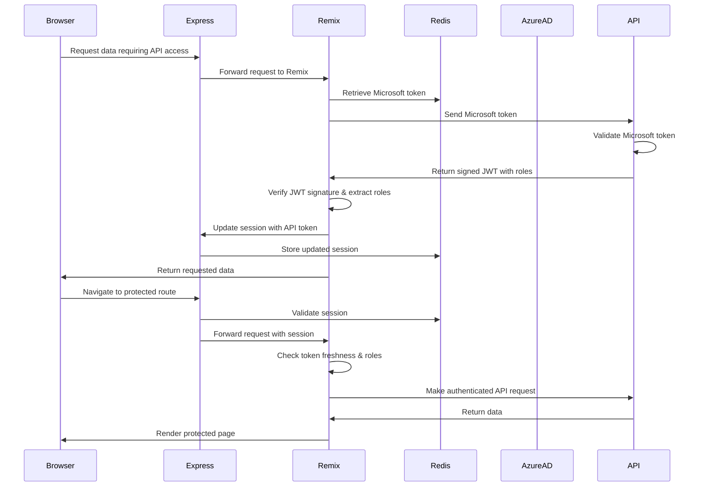
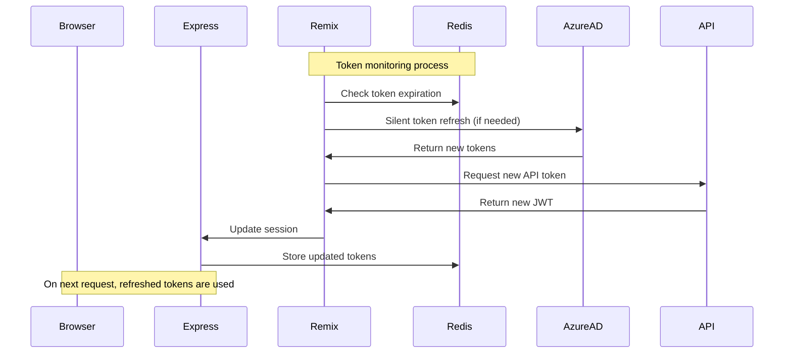

# Secure Token-Based Authentication Architecture with Remix SSR

This document details the secure token-based authentication architecture for an application using Microsoft Entra ID (formerly Azure AD) SSO, Remix, and a .NET backend API. Due to Remix's lack of middleware support, Express is used to provide consistent session management across the entire request pipeline, ensuring a unified authentication state for all requests. The design ensures that sensitive tokens remain hidden from client-side exposure while enabling secure authorization throughout the application stack.

## 1. Overview

- **Microsoft Entra ID** serves as the identity provider (IdP) using OAuth 2.0/OpenID Connect protocols
- **Express Middleware** provides secure session management with configurable storage backends
- **Remix Application** handles MSAL token management and protected route authorization
- **.NET Backend API** resides on a private network and handles business logic and data access
- **Token Security Model**: Sensitive tokens never reach the client browser, with all token handling occurring server-side

---

## 2. Detailed Workflow

### 2.1. User Authentication via Entra ID

1. **User Login:**

   - The user accesses the application and initiates login
   - Server-side Remix action generates PKCE challenge and state parameters
   - User is redirected to Microsoft Entra ID with PKCE code challenge
   - Entra ID authenticates the user and returns authorization code
   - Code is exchanged for tokens using PKCE verifier:
     - **ID Token**: Contains user identity claims
     - **Access Token**: For accessing Microsoft resources
     - **Refresh Token**: For obtaining new tokens without re-authentication

2. **Token Handling:**
   - All tokens are processed exclusively on the server side within Remix
   - Tokens never reach the client JavaScript environment
   - Distributed token cache supports scaling across multiple servers
   - PKCE and state validation protect against CSRF and code injection attacks

---

### 2.2. Server-Side Token Management

1. **Session Management:**

   - Express session middleware intercepts requests early in pipeline
   - Session validation occurs before reaching Remix routes/loaders
   - Enables consistent session state across entire application
   - Configurable session storage (in-memory/Redis)
   - Built-in session exclusion for common endpoints:
     - Health check endpoints
     - Build info endpoints
     - Public well-known endpoints
   - Configurable exclusion patterns for additional public paths
   - HTTP-only, secure cookies prevent client-side access

2. **Security:**
   - Sessions store tokens securely on the server
   - Cookie security enforced (HttpOnly, Secure, SameSite)
   - Support for secret rotation
   - Configurable public endpoint access

---

### 2.3. Token Enrichment in the Backend API

1. **Token Enrichment Process:**

   - Server-side code forwards Microsoft access token to backend API
   - Backend validates Microsoft token and enriches with additional claims
   - Returned JWT is verified using cryptographic signature
   - User roles are extracted from JWT claims
     - Supports both string and array role formats
     - Roles stored in session for authorization checks

2. **Token Usage:**
   - Enriched JWT used for backend API authorization
   - Token expiration monitored with automatic refresh
   - User roles drive fine-grained permissions control
   - Server-side role checks protect sensitive operations

---

### 2.4. Secure Token Usage by Remix

1. **Token Storage:**

   - Distributed token caching for scalability
   - Secure token storage with user isolation
   - Efficient token refresh handling

2. **Token Usage in Remix:**
   - Protected routes require authentication
   - Automatic token management
   - Role-based access control
   - Graceful error handling

---

### 2.5. Token Expiration and Refresh Flow

1. **Token Management:**

   - Automatic token refresh before expiration
   - Distributed token caching for high availability
   - Graceful failure handling with login redirect

2. **API Authorization:**

   - Proactive token renewal
   - Automated role and permission updates
   - Secure token validation

3. **User Experience:**
   - Transparent token management
   - Uninterrupted user sessions
   - Graceful error handling

---

## 3. Security Considerations

1. **Authentication:**

   - PKCE and state validation for secure token exchange
   - Server-side token processing
   - Multi-level validation and authorization

2. **Session Management:**

   - Secure session storage
   - Protected session cookies
   - Secret rotation support
   - Public endpoint configuration

3. **Access Control:**

   - Role-based authorization
   - Token expiration enforcement
   - Secure error handling

---

## 4. Benefits of This Architecture

1. **Enhanced Security:**

   - Tokens remain server-side, eliminating client-side token theft risks
   - Clear separation between authentication and UI rendering
   - Reduced attack surface with fewer client-side security concerns

2. **Simplified Authorization:**

   - By embedding user roles and other claims in the JWT, backend services can quickly authorize requests
   - Centralized permission management
   - Consistent authorization model across services

3. **Improved User Experience:**

   - Fast page loads with server-rendered content
   - Seamless authentication with minimal redirects
   - Progressive enhancement with client-side hydration

4. **Developer Experience:**

   - Unified programming model with co-located route and data requirements
   - Single session management layer through Express middleware
   - Consistent authentication state across all requests
   - Type safety from server to client
   - Simplified debugging with clear request/response flows

5. **Performance Benefits:**
   - Early session validation in request pipeline
   - Reduced client-side JavaScript bundle size (no auth libraries needed)
   - Parallel data loading during server rendering
   - Efficient HTTP caching capabilities

---

## 5. Summary Flow

### Authentication & Session Establishment

### API Access & Protected Routes

### Token Lifecycle Management

---

This architecture provides a secure, efficient, and scalable authentication solution that leverages Microsoft Entra ID SSO while keeping sensitive tokens protected through server-side processing. The Remix framework's unified approach eliminates many common security concerns by handling tokens exclusively on the server.
